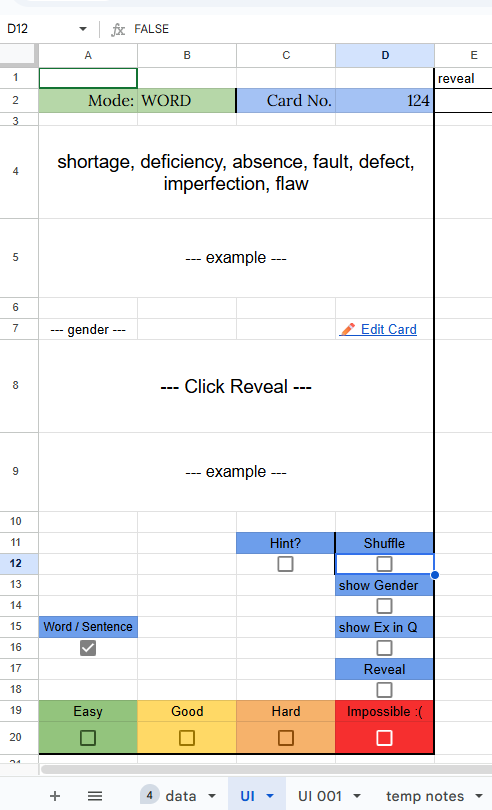
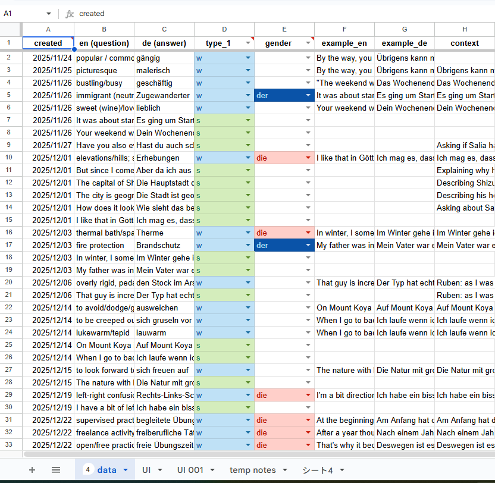

# german-srs-app# 🇩🇪 LingoSheet: Custom Spaced-Repetition System (SRS)

A high-performance, mobile-optimized language learning application built on the Google Workspace ecosystem. This tool automates vocabulary retention through custom JavaScript logic and a dynamic user interface.

## 🚀 Key Features
- **Smart Shuffle Engine:** A weighted randomization algorithm that prioritizes "Hard" vocabulary over mastered words.
- **Mobile-First UX:** Custom-engineered touch targets and "Button Areas" designed for one-handed thumb navigation.
- **Dynamic Cloze Deletion:** A randomized hint generator that utilizes JavaScript string manipulation to hide context-clues for enhanced recall.
- **Dual-Mode Learning:** Toggle system to switch between "Word" (vocabulary) and "Sentence" (grammar/context) modes.
- **Automated Metadata:** Tracks study dates, priority shifts, and performance metrics automatically.

## 🛠️ Technical Stack
- **Language:** JavaScript (Google Apps Script)
- **Engine:** Google V8 Runtime
- **Frontend:** Google Sheets UI with Conditional Formatting
- **Data Store:** Structured Spreadsheet DB

## 🧠 Logic Highlight: The Priority Engine
The core of the app uses a priority-based filtering system. Instead of simple randomization, the script evaluates the `Priority` column (H) to ensure low-confidence items appear more frequently, simulating professional SRS software like Anki.

## 📸 Preview

*Caption: Demonstrating the "Shuffle" logic and the "Random Hint" generator.*

## ⚙️ Setup for Developers
1. Create a Google Sheet with columns A-M as defined in the data sheet.
2. Open `Extensions > Apps Script`.
3. Paste the provided `Code.gs` into the editor.
4. Set up an `onEdit` trigger to handle UI interactions.
